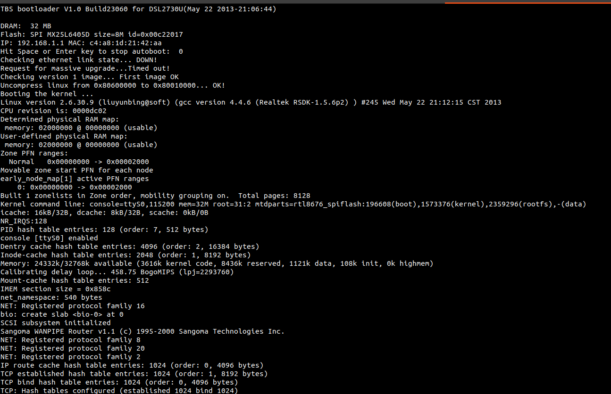

# Reverse engineering - Get root shell access to D-Link DSL-2730U using UART(Get WiFi password)
# Introduction
Hello there. In this article I will be showing you a very commonly used reverse engineering and hardware hacking technique to gain root access to the shell of a WiFi
router and retrieve the WLAN SSID and password. It also works for many other kinds of embedded devices too but
here I will be showing you my experience with a WiFi router D-Link
DSL-2730U. This is my first blog ever so it is a brand new experience for
me. Although I will do my best to make this content a very valuable and
interesting one.

**NOTE: If you find any incomplete, missing or even misleading information here, then please put it in the comments. I would love to learn even more.**

# Prerequisites
It is best if you have a fair amount of experience in the
following: 
- Linux fundamentals and sysadmin skills.
- Fair amount of hands-on experience with Arduino or Raspberry Pi projects.
- Building custom Linux systems for embedded devices(Buildroot, Yocto, Busybox, etc.).
- Protocols like - UART, SPI, I2C, etc.

You do not necessarily need to have an advanced skillset in the above mentioned area. I will try my best to make this as comprehensive as possible wherever required.

# Hardware requirements
- A USB to UART converter. Example: [CP2102](https://www.electronicscomp.com/cp2102-usb-2-to-ttl-uart-serial-converter-module-6-pin?gclid=Cj0KCQjwraqHBhDsARIsAKuGZeHA_ixiCPLCcqCc-qxB-mlAK5JN6clai0ld3tGYapd8H6D7Ij4PqFUaAprCEALw_wcB)

- D-Link DSL-2730U

- A Linux or Windows computer. I will be using Linux(Ubuntu), so if you are using windows the applications used might be different.

- A serial terminal application: screen, minicom, putty, etc. I will be using *screen* because of its simplicity.
# Under the hood
**D-Link DSL-2730U**


Under the hood, the D-Link DSL-2730U contains a chip called RTL8672 from Realtek as the main brain of the whole system. It is an embedded RISC network processor with MIPS I instruction set with a clock speed of about 400MHz(*From the documentation of RTL8672*). I had trouble finding the datasheets and reference manuals for this chip but somehow I found one on scribd which was, again, not for free. But anyway in this article the hardware details are not really required since all we are getting into is to find where the network and wifi details are stored. Once you get to the part where you can access the shell you can simply get the processor details by running this command:

```
/ $ cat /proc/cpuinfo 
system type             : RTL8672
processor               : 0
cpu model               : 56322
BogoMIPS                : 458.75
tlb_entries             : 64
mips16 implemented      : yes
```

Till then be patient :).

From my vague research I am into a slight discrepancy. I found that some other version of this model called DSL-2730U C1 has a broadcom chip. Also, the main SOC in my device is named RTL8676 but /proc/cpuinfo shows RTL8672 as seen above. But in this article we don't have to worry about all those details much. We are just going to be reading some network related file contents inside the system. Nothing of the low-level stuffs.

So moving forward, the router is based on Linux. Yes, it has Linux in it and most routers have it too. It is an embedded Linux based on [busybox](https://busybox.net/about.html). We will get to this soon when we get the shell access.

# Steps to get the shell access
Here I will explain in a very few simple steps of how to get to the shell, FYI, the linux shell.
## 1. Finding a way to access the system
There are different ways to get access to the firmware of an embedded device and observe what it is doing. But these methods are actually meant for debugging purposes. For example, we use JTAG or SerialWire to debug the step-by-step execution of the firmware or access memory contents. UART, on the other hand, is popularly used to view debugging messages or to provide access to the OS shell. And there are many other possible ways to provide a means to perform debugging operations. These interfaces are mostly hidden when it comes to a production device and are only known to the OEM. Sometimes there might not even be a such backdoors after production.

But from the perspective of reverse-engineering, we see these interfaces as a backdoor to the internal system. It is just a matter of finding it.

In this article, we will be using UART as the gateway to the internal system. We just have to find it.

## 2. Identifying UART in the board
### What is UART?
Before attempting to identify the UART interface you need to have a basic understanding of the protocol itself.

UART(Universal Asynchronous Reveiver/Transmitter) is a serial protocol that contains 4 pins:
- VCC(+): Positive power supply.
- GND(-): Ground.
- Rx(Receiver): Serial data receive pin.
- Tx(Transmitter): Serial data transmit pin.

The connection is as follows:


On the receiver side Rx pin receives the data transmitted from the Tx pin of the sender, and vice versa. UART is an synchronous communication protocol which means there is no common clock signal, so both sender and receiver has comply on certain things in order to make the communication meaningful.

**Baud rate**: It is the rate at which the data is transmitted or received. Commonly used baud rates are 4800, 9600, 115200, etc.

**Packet format**:  


There are many resources available online that will give you the details of UART. 

## Identification steps
The approach that I used to identify UART ports/pins in the board is pretty simple and straight forward. Let's figure out step-by-step:

- **Identifying pins**: Search for any pins with or without headers. If you see 4 consecutive pins together then most probably it is a UART port. FYI, it may not always be true for every boards, but what's wrong it giving it a try.
- **Identify VCC and GND**: Using a multimeter do a continuity test over each combination of two pins. If there is a continuity, then those pins are probably VCC and GND. Now, power on the device and measure the voltage across these two pins. If it shows a steady 3.3V or 5V regardless of the polarity then you have found it. Just make sure of the polarity and mark them as VCC and GND.

    

- **Identify Rx/Tx**: Now we are left with two pins which are either RX or TX. Now hook up the USB-to-UART converter. Check what device name it has been assigned by linux, probably /dev/ttyUSB0. The next thing we need to worry about is the UART configuration. The most commonly used configuration is 115200,8n1. This means:  
*'115200'*: baud rate of 115200bps  
*'8'*: 8-bit data/payload length  
*'n'*: for no-parity-check  
*'1'*: for 1-bit stop bit.

We can start off by trying this configuration first.

Start the *screen* utility on /dev/ttyUSB0 with the above mentioned configuration:
```
$ sudo screen /dev/ttyUSB0 115200
```

Now all you have to do is a little trial-and-error:  
Step 1: Connect the RX and TX of the USB-to-UART converter to the remaining two UART pins in the board.  
Step 2: Power off and on the device.  
Step 3: See if any readable texts shows up in the *screen* utility.  
Step 4: If not then repeat from step 1 by changing the order of the RX and TX pins. Else we are good to go.  

If you are lucky, you will see the linux boot-up logs on your terminal window, something like this:  


Now you can mark the pins appropriately. In my case, this are the pins:  


## 3. Into to the root shell
If you have successfully finished the previous step then by now you should be able to see the boot-up logs in the *screen* utility. Wait for it too boot up. Try pressing ENTER a couple of time until you see the shell prompt, something like this:


You can also verify whether you are `root`:
```
/ $ echo $USER
root
```
That's pretty much it. Now you can just play around with it like you would in a regular linux shell.

# Finding the WiFi credentials
My goal of trying out this reverse-engineering trick was just to find how and where the WiFi credentials are located. So I went on browsing the file system and finally found a file that contained wifi password in plaintext. I wouldn't like to mention the file name because I don't want to the risk and face any legal issues, even though the vulnerability might already be known. But I can show the output of how it looks:


# Conclusion
This article was mainly about my experience with D-Link DSL 2730U device specifically. Other devices may have different sort of way to do the same. But the key concept remains the same.  
Apart from getting the WiFi password there might be other vulnerabilities that we can exploit after getting the root shell access. There are quite a few resources online that you can go through to get more exposure to the reverse engineering world. There are a couple of great videos on youtube which demonstrates cool hardware hacking techniques. The links to all the useful resources can be found below in the references section.

Security in embedded/IOT devices is also a very important factor since most of these devices are used in a day to day basis. IP Cameras, smart watches, health monitoring devices, etc, are some of the most commonly used IOT devices out there. IOT devices are very prone to vulnerabilities since most of them are deployed by manufacturers in a rapid manner in order to get the product to market very fast. This causes most of them to not being properly revised in the security side of the overall system. And other thing fact is also that these devices have very limited computing resources compared to our regular desktop computers or server machines. So any software running in it have to be minimalistic which may require sacrificing the security concerns. That is the main reason it becomes an easy target for hackers. But anyways, many manufacturers currently are constantly making sure to take care of the security issues. 

There are much more details regarding the whole philosophy hacking IOT devices or even just hacking in general. I am no expert in this field but I find it interesting to learn somethings in it and also I believe it will make me a better Software Engineer.

# References and useful resources

- [UART](https://en.wikipedia.org/wiki/Universal_asynchronous_receiver-transmitter)

- [Busybox](https://busybox.net/about.html)

- [Reverse engineering UART to gain shell](https://medium.com/@shubhamgolam10/reverse-engineering-uart-to-gain-shell-de9019ae427a)

- [(Video)Intro to Hardware Reversing: Finding a UART and getting a shell](https://www.youtube.com/watch?v=ZmZuKA-Rst0)

- [(Video)Philippe Laulheret - Intro to Hardware Hacking - DEF CON 27 Conference](https://www.youtube.com/watch?v=HuCbr2588-w)

- *Sorry I don't have full access to the RTL8672 datasheet. I just found one on [scribd](https://www.scribd.com/home) which is on subscription basis and not downloadable.*